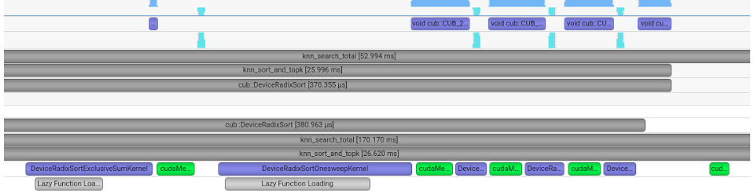
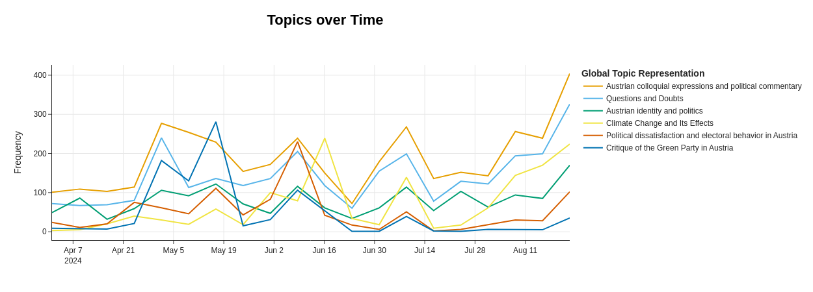

# Collection of Jupyter Notebooks

This repository contains Jupyter notebooks, covering distinct data science topics I've been researching.

For better rendering, I advise you to view the notebooks in direct HTML format by clicking on the headings below.

## Overview

### [Vector search optimization using NVIDIA Nsight Systems](Vector_search_optimization_using_NVIDIA_Nsight_Systems/Vector_search_optimization_using_NVIDIA_Nsight_Systems.html)

This notebook focuses on optimizing vector search operations by comparing implementations such as Faiss, cuVS, and CuPy. It uses NVIDIA Nsight Systems for profiling and performance analysis to enhance GPU-accelerated nearest neighbor search speed and scalability.

*Timeline visualization from NVIDIA Nsight Systems showing the execution of CUDA kernels and memory operations during the vector search process.*

### [Detecting near duplicates using Jaccard similarity and MinHashing](Detecting_near_duplicates_using_Jaccard_similarity_and_MinHashing/Detecting_near_duplicates_using_Jaccard_similarity_and_MinHashing.html)

Explores methods to detect near duplicates in data using Jaccard similarity and MinHashing techniques.

### [Topic Modeling of Austrian Reddit Posts Using BERTopic](Topic_modeling_of_Austrian_Reddit_posts_using_BERTopic/Topic_modeling_of_Austrian_Reddit_posts_using_BERTopic.html)

Demonstrates the use of BERTopic for topic modeling on Reddit posts related to Austria, from the period of the 2024 European Parliament elections. It includes data preprocessing, topic extraction, and visualization of topic trends over time. The analysis uncovers key themes in the Reddit dataset, leveraging statistical learning and unsupervised clustering of keywords.

*This graph visualizes the frequency of selected discussion topics on Austrian Reddit over time, highlighting how public sentiment aligns with the election cycle.*

### [Data preprocessing for Bayesian model of bike rentals](Data_preprocessing_for_Bayesian_model_of_bike_rentals/Data_preprocessing_for_Bayesian_model_of_bike_rentals.html)

Covers essential steps for preparing a (bike rental) dataset for Bayesian network modeling. It includes data distribution inspection, outlier and multicollinearity checks, missing value imputation, continuous variable categorization, and calculation of Weight of Evidence (WoE) and Information Value (IV) scores.